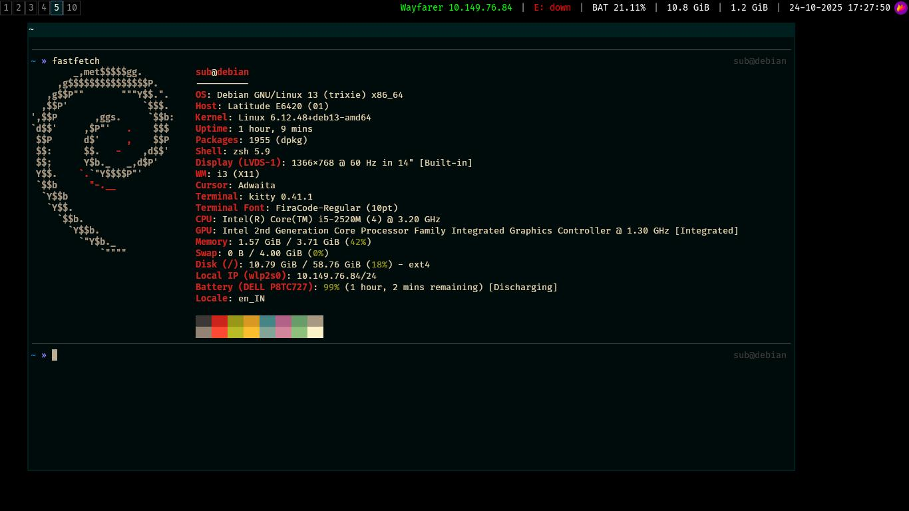

# Subramanya's dotfiles



## Usage

Use with proper care (and at your own risk!)

```curl -fsSL https://subramanyaj.github.io/dotfiles | bash``` does the trick on a fresh Debian 13 installation.

I'm mostly keeping this here so that I can clone this around on all the computers in the computer lab XD.
